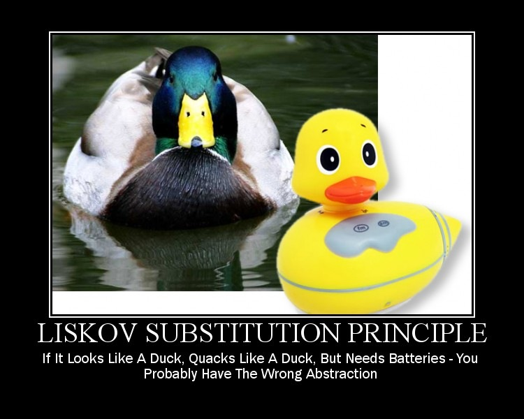

# Object Oriented Design

---

## SOLID

---

# Single Responsibility Principle

**Every class should have a single responsibility**. There should **never be more than one reason for a class to change**.

 - Smaller classes
 - Avoid *god* classes

---

---

# Open/Closed Principle

Software entities should be **open for extension**, but **closed for modification**. 

 - An entity can allow its behaviour to be extended without modifying its source code

---

---

# Liskov Substitution Principle

Objects in a program should be **replaceable with instances of their subtypes without altering the correctness** of the program.

 - *Violation:* Square is a subclass of Rectangle

---

---

# Interface Segregation Principle

**Many** client-specific **interfaces are better than one** general-purpose interface.

 - Low coupling
 *degree of interdependence between software modules*
 - High cohesion 
 *degree to which the elements of a module belong together*
 

---

---

# Dependency Inversion Principle

 A. High-level modules should not depend on low-level modules. Both should depend on abstractions.
 B. Abstractions should not depend on details. Details should depend on abstractions.
 
 Use the same level of abstraction at a given level

Also, rather than working with classes that are tight coupled, use interfaces. This is called programming to the interface. This *reduces dependency* on implementation specifics and makes code *more reusable*.

---

---

## Resources

---

## Head Firts Object-Oriented Analysis and Design

## Head First Design Patterns

---

## Clean Code

Avoid ugly code

 * Naming
 * Functions
 * Comments
 * Formating

---

## Pragmatic Programmer

How to work as a programmer.

 * Responsibily
 * Quality
 * Estimating

---

## Design Patterns
### Elements of Reuseable Object-Oriented Software

Important and recurring designs in OO systems

* Creational Patterns
* Structural Patterns
* Behavioral Patterns

---
## Refactoring to Patterns

Improve your code with the classic solutions to recurring design problems.

 * Code Smells
 * Move creation knowledge to Factory
 

--- 

## The Pracice of Programming

Recommendation by Joao

 * debugging
 * testing
 * performance
 * portability
 * design
 * interfaces
 * style
 * notation

---

## Working Effectively with Legacy Code

Recommendation by Ben

Accurately identifying where code changes need to be made Coping with legacy systems that aren t object-oriented. Handling applications that don t seem to have any structure.

This book also includes a catalog of twenty-four dependency-breaking techniques that help 
you work with program elements in isolation and make safer changes.

---

## Refactoring: Improving the Design of Existing Code

Recommendation by Ben

A collection of techniques to improve the structural integrity and performance existing software programs

